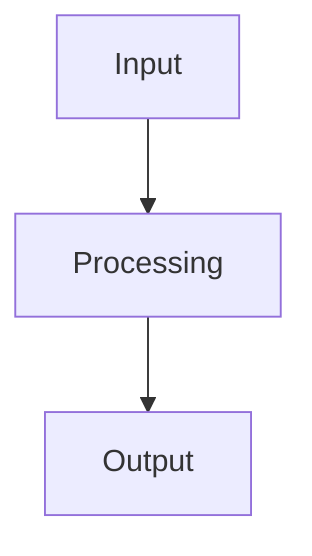
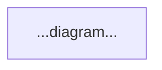
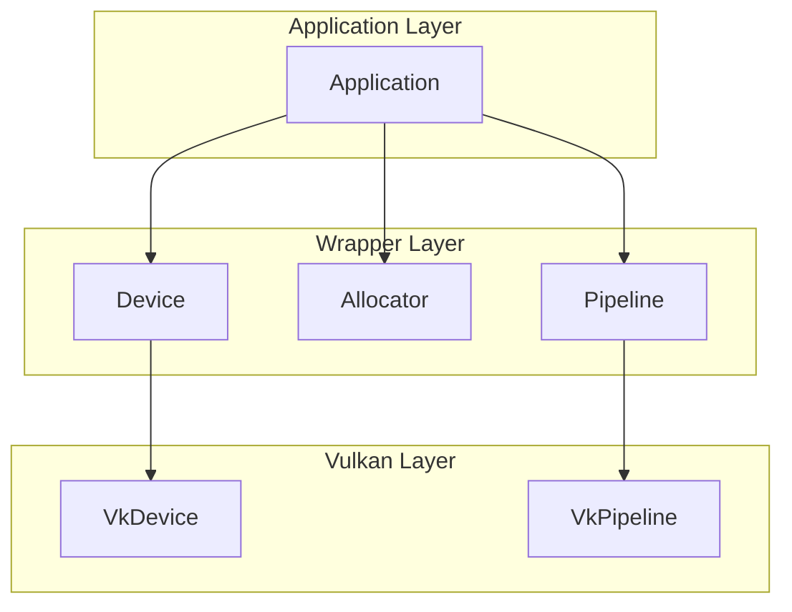
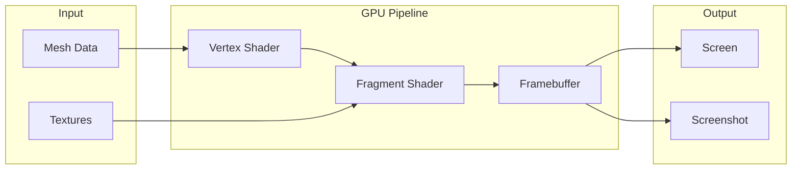
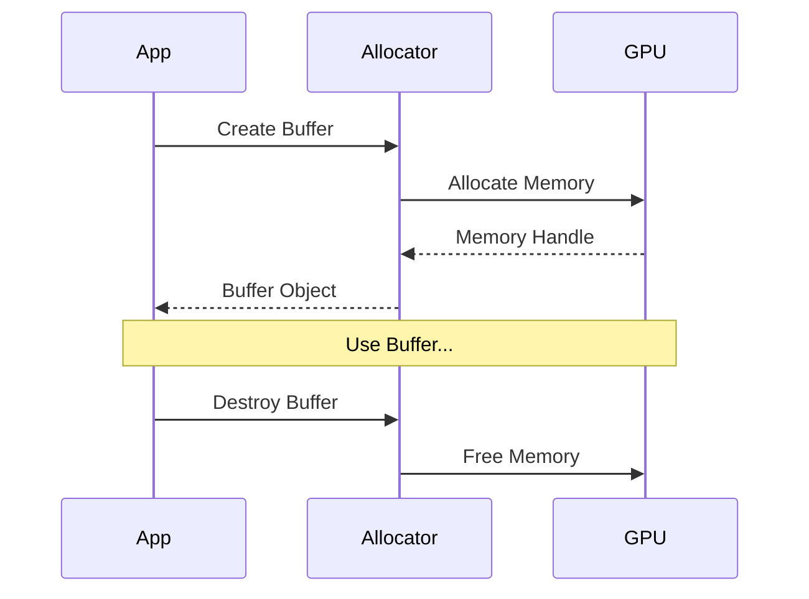
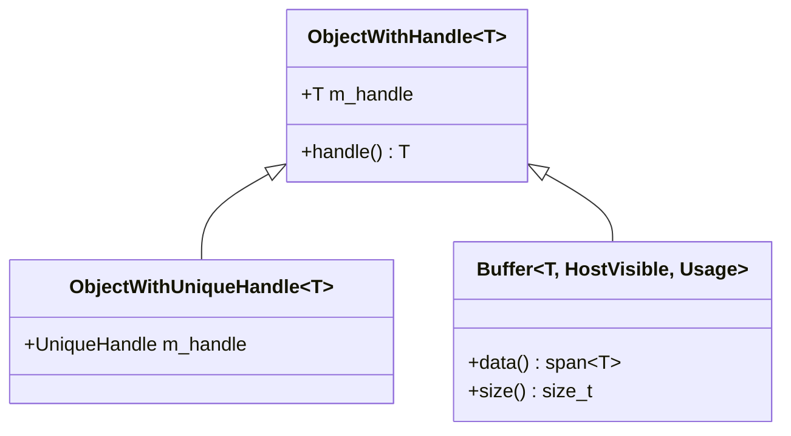

# Documentation Skill Specification

This document defines a reusable documentation skill for creating tutorial-based documentation for the VulkanWrapper library.

## Overview

The documentation skill creates **tutorial-like documentation** where each concept is:
1. Explained with clear text and diagrams
2. Demonstrated with a **minimal viable example** that produces a visual screenshot
3. Rendered as a Docusaurus webpage

## Directory Structure

```
docs/
├── DOCUMENTATION_SKILL.md     # This skill specification
├── docusaurus/                # Docusaurus site configuration
│   ├── docusaurus.config.js
│   ├── sidebars.js
│   ├── package.json
│   └── docs/                  # Generated documentation pages
│       ├── intro.md
│       ├── getting-started/
│       ├── tutorials/
│       └── api-reference/
├── tutorials/                 # Minimal viable example code
│   ├── CMakeLists.txt
│   ├── TutorialFramework/     # Shared tutorial utilities
│   ├── 01-triangle/           # First tutorial
│   ├── 02-texture/            # Second tutorial
│   └── ...
├── schemas/                   # Mermaid/PlantUML diagram sources
│   └── templates/
└── screenshots/               # Generated screenshots from tutorials
```

## Documentation Agent Workflow

### Step 1: Identify Documentation Target

Determine what needs to be documented:
- A new feature or class
- A rendering technique
- An API pattern or concept

### Step 2: Create Schema Diagram

Before writing code or text, create a visual schema explaining the concept:



Use Mermaid diagrams for:
- **Architecture diagrams**: Show component relationships
- **Sequence diagrams**: Show temporal flow
- **Class diagrams**: Show type hierarchies
- **Flowcharts**: Show decision logic

### Step 3: Create Minimal Viable Example

Each tutorial MUST have a corresponding executable example that:

1. **Is self-contained**: Only depends on VulkanWrapper and TutorialFramework
2. **Is minimal**: Contains ONLY code necessary to demonstrate the concept
3. **Produces a screenshot**: Automatically saves `screenshot.png` on completion
4. **Follows the template structure**

Example template:
```cpp
#include "TutorialFramework/TutorialApp.h"

class MyTutorial : public TutorialApp {
public:
    MyTutorial() : TutorialApp("Tutorial Name", 800, 600) {}

    void setup() override {
        // Initialize resources
    }

    void render(vk::CommandBuffer cmd) override {
        // Render single frame
    }

    void cleanup() override {
        // Cleanup resources
    }
};

int main() {
    MyTutorial app;
    app.run();  // Renders frame and saves screenshot
    return 0;
}
```

### Step 4: Write Tutorial Documentation

Create a Docusaurus markdown file following this template:

```markdown
---
sidebar_position: N
title: Tutorial Title
description: Brief description
---

# Tutorial Title

## Overview

Brief explanation of what this tutorial teaches.

## Concepts

### Key Concept 1

Explanation with code snippets.

### Key Concept 2

Explanation with code snippets.

## Architecture



## Implementation

### Step 1: Setup

```cpp
// Code snippet with explanation
```

### Step 2: Main Logic

```cpp
// Code snippet with explanation
```

## Result


## Full Source Code

Link to or embed the complete example code.

## Next Steps

Links to related tutorials.
```

### Step 5: Generate Screenshot

Run the tutorial example to generate the screenshot:

```bash
cd build-Clang20Debug/docs/tutorials/XX-name
./TutorialXX
# Screenshot saved to screenshot.png
```

Copy screenshot to documentation:
```bash
cp screenshot.png ../../docusaurus/static/img/tutorials/
```

### Step 6: Build Documentation

```bash
cd docs/docusaurus
npm install
npm run build
```

## Schema Templates

### Template 1: Component Architecture



### Template 2: Render Pipeline Flow



### Template 3: Resource Lifetime



### Template 4: Class Hierarchy



## Coding Standards for Tutorials

### 1. Simplicity First

- Remove all non-essential code
- Use hardcoded values instead of configuration
- Avoid abstractions that hide the concept being taught

### 2. Explicit Over Implicit

- Show all Vulkan calls explicitly
- Don't hide initialization in base classes (except common boilerplate)
- Comment each significant line

### 3. Error Handling

- Use simple error checking (assert or throw)
- Don't add production-level error handling
- Focus on the happy path

### 4. Naming

- Use descriptive names that match Vulkan terminology
- Prefix tutorial-specific code with `tutorial_`
- Keep names consistent across tutorials

## Tutorial Categories

### Getting Started
1. **Hello Triangle**: Basic rendering pipeline
2. **Hello Texture**: Texture mapping
3. **Hello 3D**: 3D transformations

### Core Concepts
4. **Buffers**: Buffer types and memory
5. **Images**: Image creation and views
6. **Descriptors**: Descriptor sets and bindings
7. **Pipelines**: Graphics pipeline configuration

### Intermediate
8. **Model Loading**: Loading 3D models
9. **Materials**: Material system
10. **Lighting**: Basic lighting

### Advanced
11. **Deferred Rendering**: G-Buffer technique
12. **Ray Tracing**: Hardware ray tracing
13. **Post Processing**: Screen-space effects

## Validation Checklist

Before submitting documentation:

- [ ] Schema diagram created and renders correctly
- [ ] Minimal example compiles without errors
- [ ] Example produces screenshot on run
- [ ] Screenshot is clear and demonstrates the concept
- [ ] Tutorial text explains all code
- [ ] No unnecessary complexity in example
- [ ] Links to related tutorials work
- [ ] Docusaurus builds without warnings

## Automation

The documentation build system can:

1. **Auto-generate screenshots**: Run all tutorials and capture output
2. **Validate examples**: Compile all tutorial code
3. **Check links**: Verify all documentation links work
4. **Build site**: Generate static Docusaurus site

```bash
# Build all tutorials
cmake --build build -target tutorials

# Generate all screenshots
./scripts/generate-screenshots.sh

# Build documentation site
cd docs/docusaurus && npm run build
```
