# Architecture Overview

VulkanWrapper is organized into focused modules that map closely to Vulkan concepts while providing higher-level abstractions.

## Module Organization

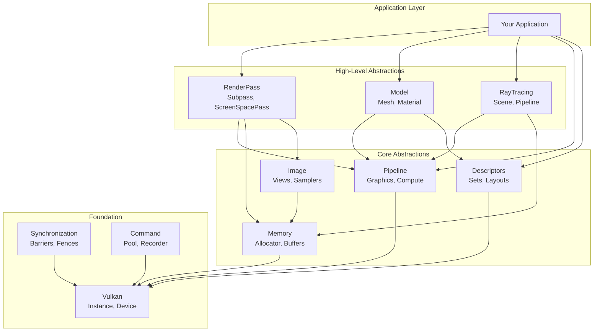

## Core Design Patterns

### 1. Builder Pattern

All major objects use fluent builders with sensible defaults:

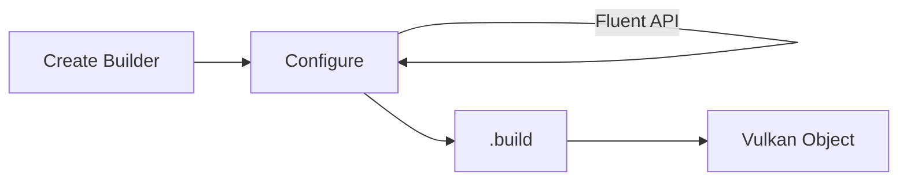

```cpp
auto pipeline = GraphicsPipelineBuilder(device)
    .set_layout(layout)
    .add_shader(vk::ShaderStageFlagBits::eVertex, vertShader)
    .add_shader(vk::ShaderStageFlagBits::eFragment, fragShader)
    .set_vertex_input<Vertex>()
    .build();
```

### 2. RAII Resource Management

Resources are automatically cleaned up when they go out of scope:

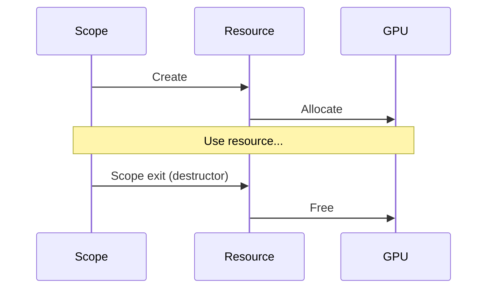

### 3. Type-Safe Templates

Compile-time validation prevents common errors:

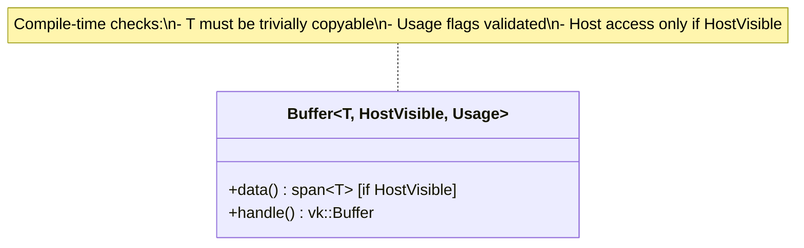

### 4. Automatic Synchronization

The `ResourceTracker` generates optimal barriers:

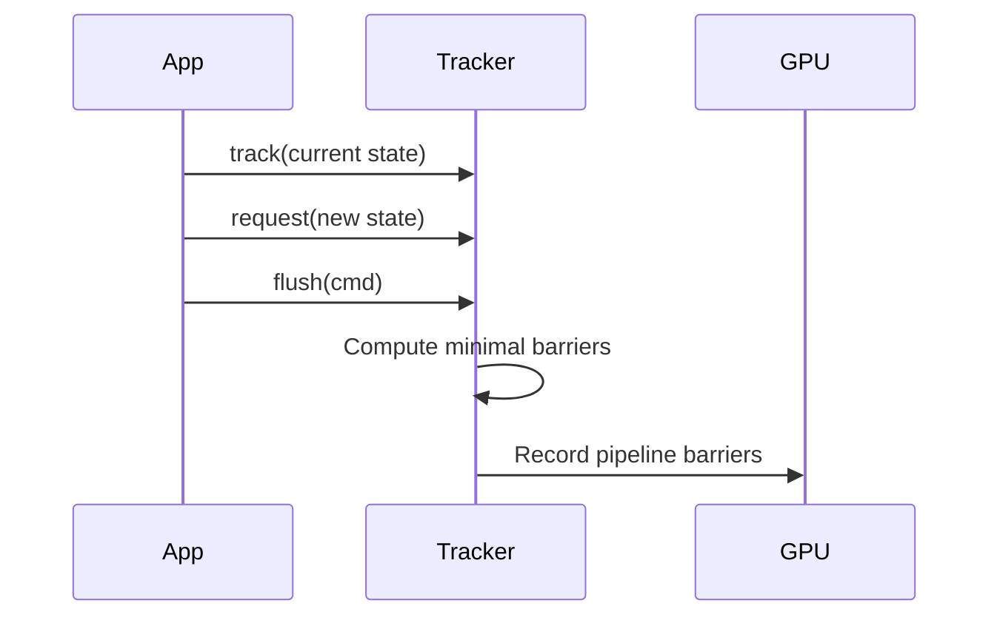

## Module Details

### Vulkan Module

Core Vulkan initialization and device management.

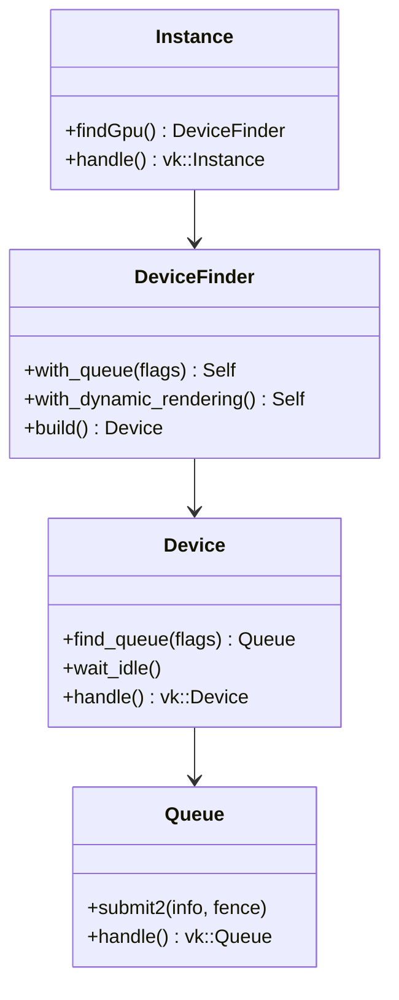

### Memory Module

Resource allocation via Vulkan Memory Allocator.

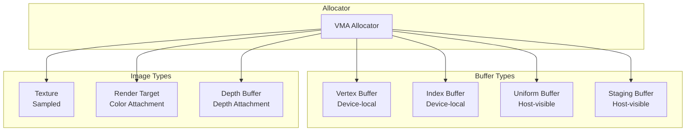

### Pipeline Module

Graphics and compute pipeline configuration.

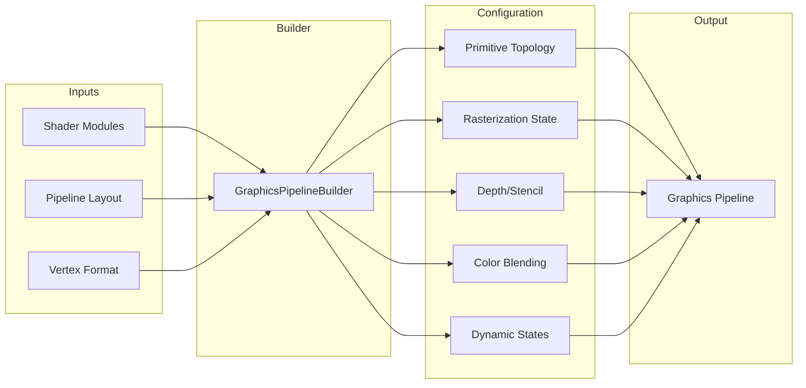

### RenderPass Module

High-level rendering abstractions using Vulkan 1.3 dynamic rendering.

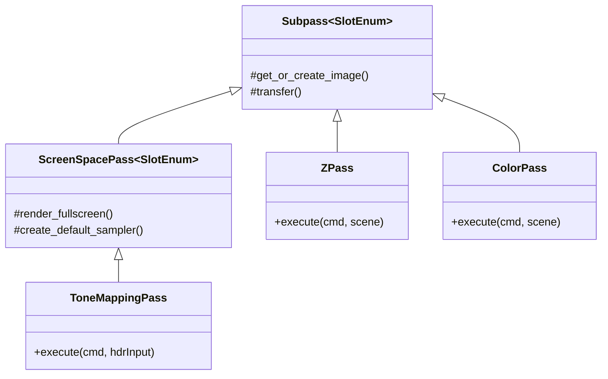

## Typical Application Flow

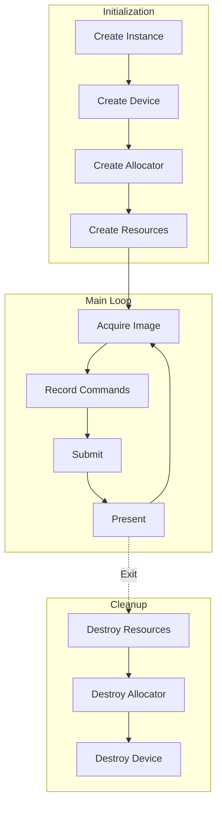

## Error Handling Strategy

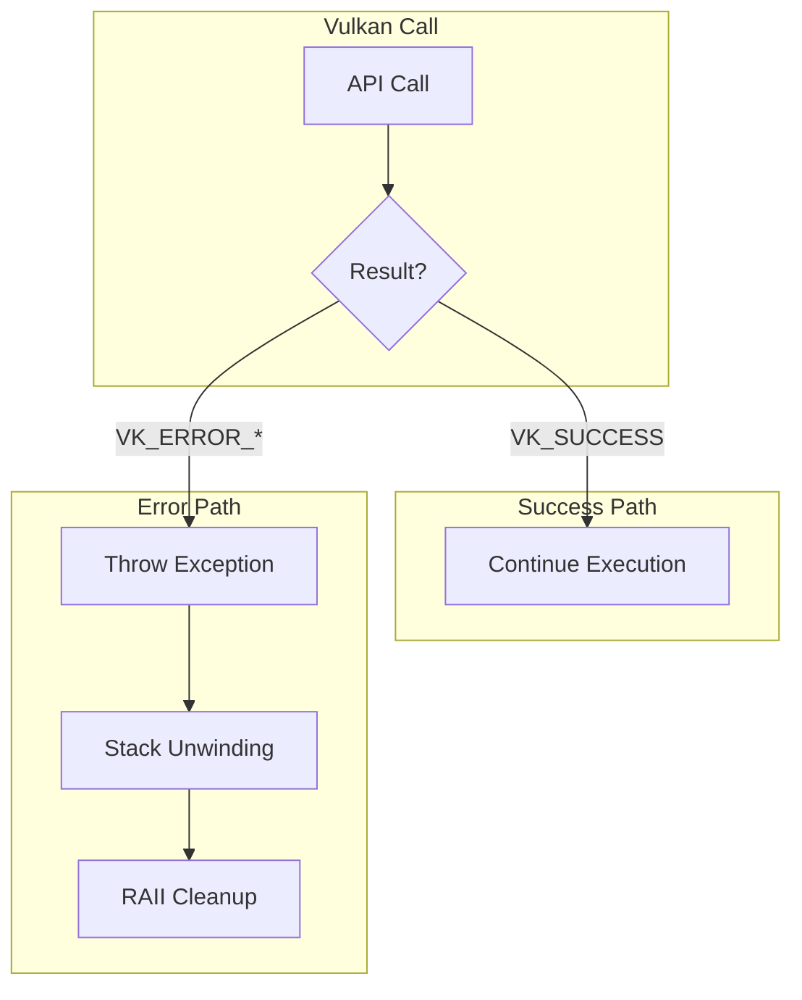

All Vulkan errors are converted to exceptions with source location information, enabling precise error reporting while RAII ensures proper cleanup.

## Next Steps

- [Memory Management](./memory-management) - Deep dive into allocation strategies
- [Resource Tracking](./resource-tracking) - Automatic barrier generation
- [Render Passes](./render-passes) - High-level rendering patterns
