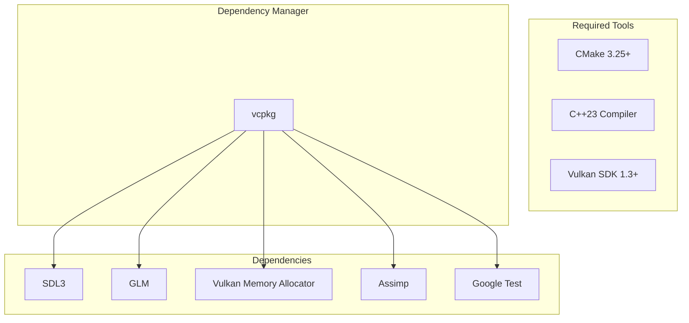
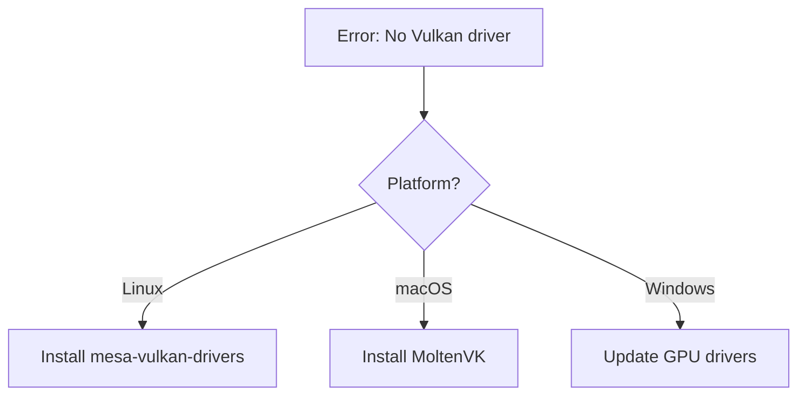

# Installation

This guide walks you through setting up your development environment for VulkanWrapper.

## Prerequisites



## Step 1: Install System Dependencies

### Linux (Ubuntu/Debian)

```bash
# Install build tools
sudo apt update
sudo apt install -y build-essential cmake ninja-build

# Install Vulkan SDK
wget -qO - https://packages.lunarg.com/lunarg-signing-key-pub.asc | sudo apt-key add -
sudo wget -qO /etc/apt/sources.list.d/lunarg-vulkan-focal.list \
    https://packages.lunarg.com/vulkan/lunarg-vulkan-focal.list
sudo apt update
sudo apt install -y vulkan-sdk

# Install Clang 18+ for C++23 support
sudo apt install -y clang-18 libc++-18-dev libc++abi-18-dev
```

### macOS

```bash
# Install Xcode command line tools
xcode-select --install

# Install Homebrew dependencies
brew install cmake ninja

# Install Vulkan SDK from https://vulkan.lunarg.com/sdk/home
# Or via Homebrew:
brew install --cask vulkan-sdk
```

### Windows

1. Install [Visual Studio 2022](https://visualstudio.microsoft.com/) with C++ workload
2. Install [CMake](https://cmake.org/download/)
3. Install [Vulkan SDK](https://vulkan.lunarg.com/sdk/home)

## Step 2: Clone the Repository

```bash
git clone https://github.com/vulkanwrapper/vulkanwrapper.git
cd vulkanwrapper
```

## Step 3: Install vcpkg Dependencies

VulkanWrapper uses vcpkg for dependency management. Dependencies are specified in `vcpkg.json`:

```json
{
  "dependencies": [
    "sdl3",
    "sdl3-image",
    "glm",
    "assimp",
    "vulkan",
    "vulkan-memory-allocator",
    "shaderc",
    "gtest"
  ]
}
```

CMake will automatically bootstrap vcpkg and install dependencies on first configure.

## Step 4: Verify Installation

After building (see next section), verify your installation:

```bash
# Run tests
cd build-Debug && ctest --verbose
```

If all tests pass, your installation is complete.

## Troubleshooting

### Vulkan Driver Not Found



**Linux:**
```bash
# For integrated/software rendering
sudo apt install mesa-vulkan-drivers

# Check Vulkan support
vulkaninfo
```

**macOS:**
MoltenVK is included with the Vulkan SDK.

**Windows:**
Update your GPU drivers from NVIDIA/AMD/Intel.

### Compiler Too Old

Ensure you have a C++23 capable compiler:

```bash
# Check Clang version (need 18+)
clang++ --version

# Check GCC version (need 13+)
g++ --version
```

### CMake Version

```bash
cmake --version  # Need 3.25+
```

## Directory Structure After Clone

```
vulkanwrapper/
├── VulkanWrapper/          # Main library source
│   ├── include/            # Public headers
│   ├── src/                # Implementation
│   └── tests/              # Unit tests
├── examples/               # Example applications
├── docs/                   # Documentation (you are here)
├── CMakeLists.txt          # Root CMake file
└── vcpkg.json              # Dependencies
```

## Next Steps

Continue to [Building](./building) to compile the library and run examples.
