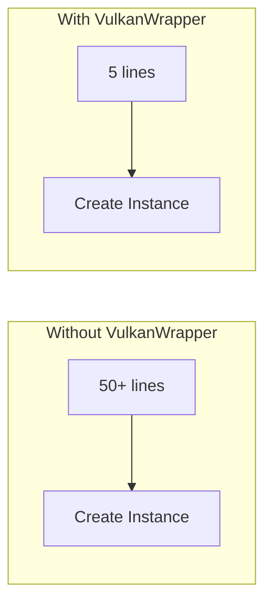
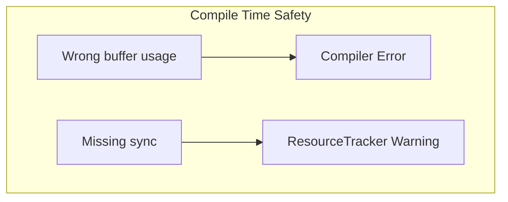
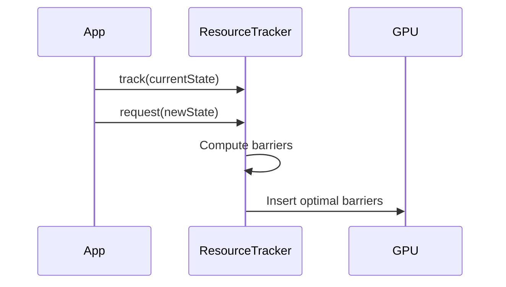
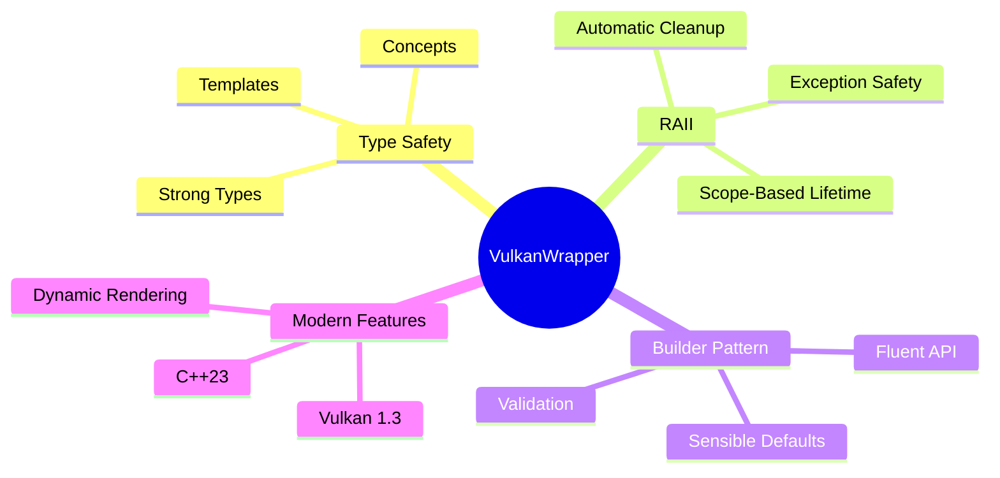

# Introduction

VulkanWrapper is a modern C++23 library that provides high-level abstractions over the Vulkan graphics API while maintaining full access to Vulkan's power and flexibility.

## Why VulkanWrapper?

Vulkan is a powerful, low-level graphics API, but its verbosity can be overwhelming. VulkanWrapper addresses this by:

### 1. Reducing Boilerplate



**Traditional Vulkan:**
```cpp
// 50+ lines of VkInstanceCreateInfo, VkApplicationInfo,
// extension enumeration, layer setup, etc.
```

**VulkanWrapper:**
```cpp
auto instance = vw::InstanceBuilder()
    .setDebug()
    .setApiVersion(vw::ApiVersion::e13)
    .build();
```

### 2. Preventing Common Errors



Type-safe buffers catch errors at compile time:

```cpp
// This won't compile - can't use vertex buffer as index buffer
using VertexBuffer = vw::Buffer<Vertex, false, VertexBufferUsage>;
using IndexBuffer = vw::Buffer<uint32_t, false, IndexBufferUsage>;

VertexBuffer vb = ...;
// cmd.bindIndexBuffer(vb);  // Compile error!
```

### 3. Automatic Resource Management



No more manual barrier management:

```cpp
vw::Transfer transfer;
transfer.resourceTracker().track(currentImageState);
transfer.resourceTracker().request(newImageState);
transfer.resourceTracker().flush(cmd);  // Barriers inserted automatically
```

## Core Modules

| Module | Purpose |
|--------|---------|
| **Vulkan** | Instance, device, and queue management |
| **Memory** | Allocator, buffers, and resource tracking |
| **Image** | Images, views, samplers, and loading |
| **Pipeline** | Graphics and compute pipelines |
| **Descriptors** | Descriptor sets and layouts |
| **RenderPass** | High-level rendering abstractions |
| **RayTracing** | Acceleration structures and RT pipelines |
| **Synchronization** | Fences, semaphores, and barriers |

## Design Principles



### Type Safety

VulkanWrapper uses C++23 features to catch errors at compile time:

- **Concepts** constrain template parameters
- **Strong types** prevent unit mismatches (Width vs Height)
- **Compile-time flags** validate buffer usage

### RAII (Resource Acquisition Is Initialization)

All Vulkan resources are automatically cleaned up:

```cpp
{
    auto buffer = allocator->create_buffer<Vertex>(...);
    // Use buffer...
} // Buffer automatically destroyed here
```

### Builder Pattern

All major objects use fluent builder APIs:

```cpp
auto pipeline = vw::GraphicsPipelineBuilder(device)
    .add_shader(vertexShader)
    .add_shader(fragmentShader)
    .set_vertex_input<Vertex>()
    .set_topology(vk::PrimitiveTopology::eTriangleList)
    .build();
```

## Requirements

- **C++23** compiler (Clang 18+, GCC 13+, MSVC 2022+)
- **Vulkan 1.3** capable GPU and driver
- **CMake 3.25+** for building

## Next Steps

Continue to [Installation](./installation) to set up your development environment.
