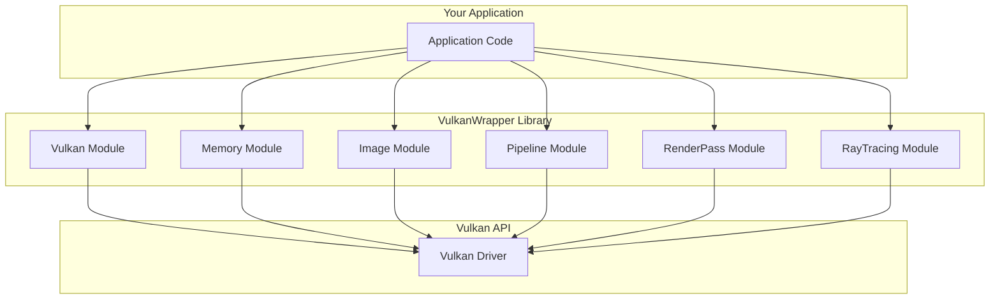
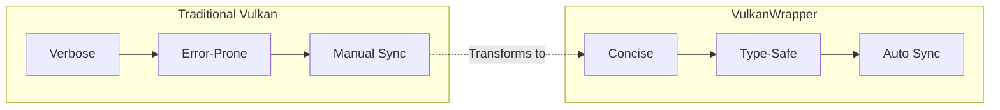

# VulkanWrapper Documentation

Welcome to the VulkanWrapper documentation. VulkanWrapper is a modern C++23 library providing high-level abstractions over the Vulkan graphics API.

## What is VulkanWrapper?

VulkanWrapper simplifies Vulkan development by providing:

- **Type Safety** through templates and concepts
- **RAII** for automatic resource management
- **Builder Patterns** for fluent object construction
- **Modern Vulkan 1.3** features (dynamic rendering, synchronization2, ray tracing)

## Architecture Overview



## Quick Example

```cpp
#include <VulkanWrapper/VulkanWrapper.h>

int main() {
    // Create Vulkan instance with validation
    auto instance = vw::InstanceBuilder()
        .setDebug()
        .setApiVersion(vw::ApiVersion::e13)
        .build();

    // Find a suitable GPU
    auto device = instance->findGpu()
        .with_queue(vk::QueueFlagBits::eGraphics)
        .with_dynamic_rendering()
        .build();

    // Create memory allocator
    auto allocator = vw::AllocatorBuilder(instance, device)
        .build();

    // Now you're ready to render!
    return 0;
}
```

## Learning Path

### Beginners

Start with the **Getting Started** section to set up your development environment, then work through the **Basic Tutorials**:

1. [Hello Triangle](./tutorials/hello-triangle) - Your first rendered image
2. [Hello Texture](./tutorials/hello-texture) - Loading and displaying textures
3. [Hello 3D](./tutorials/hello-3d) - 3D transformations and camera

### Intermediate

Once comfortable with basics, explore **Core Concepts**:

1. [Buffers](./tutorials/buffers) - Understanding buffer types and memory
2. [Images](./tutorials/images) - Image creation, views, and samplers
3. [Descriptors](./tutorials/descriptors) - Binding resources to shaders
4. [Pipelines](./tutorials/pipelines) - Configuring the graphics pipeline

### Advanced

Master advanced techniques:

1. [Deferred Rendering](./tutorials/deferred-rendering) - G-Buffer based rendering
2. [Ray Tracing](./tutorials/ray-tracing) - Hardware accelerated ray tracing
3. [Post Processing](./tutorials/post-processing) - Screen-space effects

## Key Features

| Feature | Description |
|---------|-------------|
| **Type-Safe Buffers** | Compile-time validated buffer usage flags |
| **Resource Tracking** | Automatic barrier generation |
| **Builder Pattern** | Fluent APIs for all major objects |
| **Dynamic Rendering** | No render pass objects needed |
| **Ray Tracing** | Full hardware ray tracing support |

## Design Philosophy



VulkanWrapper follows these principles:

1. **Don't hide Vulkan** - The API is a thin wrapper, not a new abstraction
2. **Prevent errors at compile time** - Use C++ type system for safety
3. **Automate the tedious** - Handle synchronization and resource management
4. **Stay modern** - Leverage Vulkan 1.3 and C++23 features

## Next Steps

- [Installation Guide](./getting-started/installation) - Set up your environment
- [Building](./getting-started/building) - Build the library and examples
- [Hello Triangle](./tutorials/hello-triangle) - Start your first tutorial
