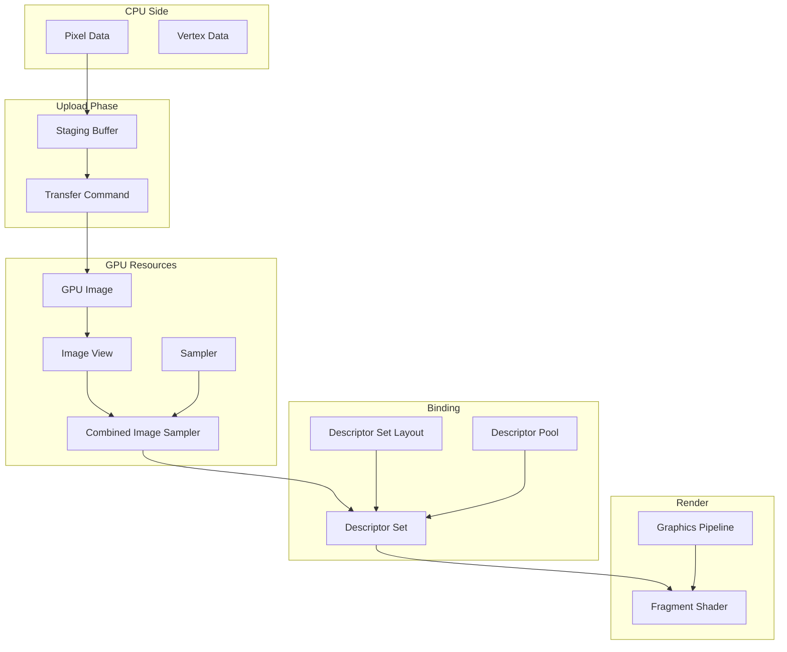
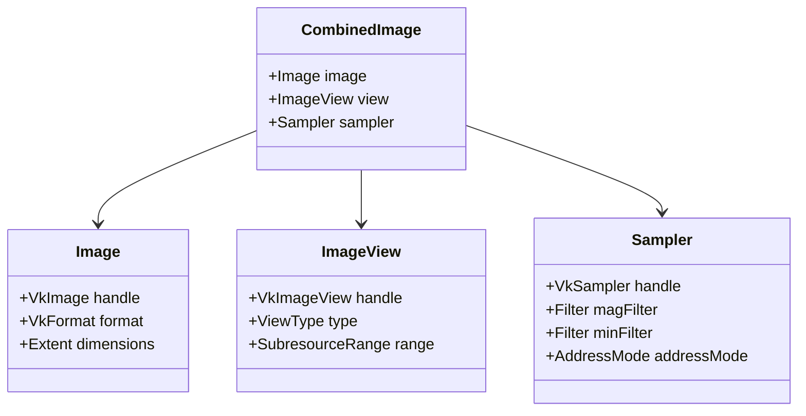
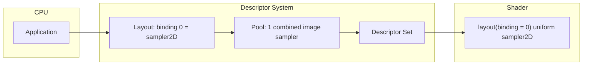
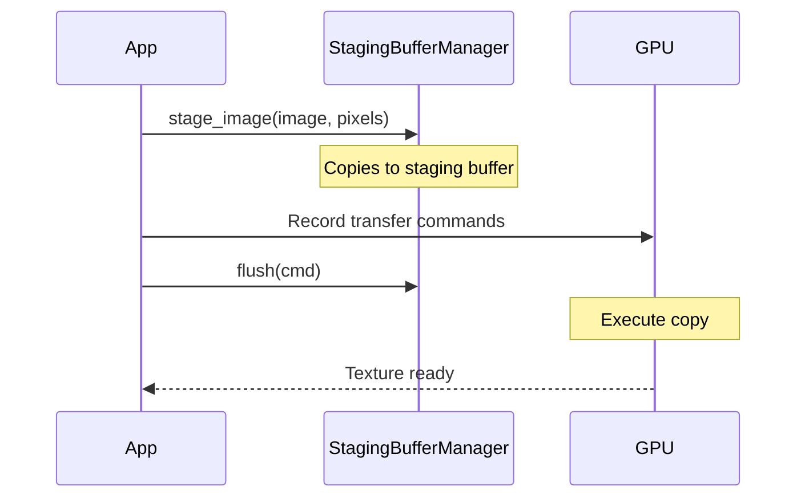
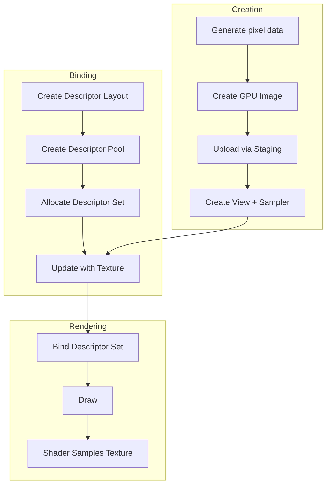

# Hello Texture

Learn to load and display textures using VulkanWrapper.

## Overview

This tutorial teaches you to:
- Create and upload texture data to the GPU
- Set up samplers for texture filtering
- Use descriptor sets to bind textures to shaders
- Sample textures in fragment shaders

## Architecture



## Concepts

### Texture Pipeline

Textures in Vulkan require several components working together:



### Descriptor Sets

Descriptor sets bind resources (textures, buffers) to shader bindings:



## Implementation

### Step 1: Create Texture Data

Generate a checkerboard pattern in CPU memory:

```cpp
constexpr uint32_t texWidth = 64;
constexpr uint32_t texHeight = 64;
constexpr uint32_t checkerSize = 8;

std::vector<uint8_t> pixels(texWidth * texHeight * 4);
for (uint32_t y = 0; y < texHeight; ++y) {
    for (uint32_t x = 0; x < texWidth; ++x) {
        uint32_t index = (y * texWidth + x) * 4;
        bool isWhite = ((x / checkerSize) + (y / checkerSize)) % 2 == 0;

        pixels[index + 0] = isWhite ? 255 : 50;  // R
        pixels[index + 1] = isWhite ? 255 : 50;  // G
        pixels[index + 2] = isWhite ? 255 : 50;  // B
        pixels[index + 3] = 255;                  // A
    }
}
```

### Step 2: Create GPU Image

Create an image that can be sampled and receive transfer data:

```cpp
auto image = allocator()->create_image(
    vk::Format::eR8G8B8A8Unorm,
    Width{texWidth},
    Height{texHeight},
    vk::ImageUsageFlagBits::eSampled |
        vk::ImageUsageFlagBits::eTransferDst);
```

### Step 3: Upload Texture Data

Use the staging buffer system to upload pixel data:



```cpp
StagingBufferManager staging(*allocator());
staging.stage_image(*image, std::span(pixels));

// Record and execute upload commands
{
    CommandBufferRecorder recorder(cmd);
    transfer().resourceTracker().flush(cmd);
    staging.flush(cmd);
}

// Submit and wait
queue().handle().submit2(submitInfo, fence.handle());
fence.wait();
```

### Step 4: Create Image View and Sampler

```cpp
// Image view - allows shader to access the image
auto imageView = ImageViewBuilder(device(), image)
    .as_2d()
    .build();

// Sampler - defines filtering and addressing
auto sampler = SamplerBuilder(device())
    .set_filter(vk::Filter::eNearest, vk::Filter::eNearest)
    .set_address_mode(vk::SamplerAddressMode::eRepeat)
    .build();
```

**Sampler Filters:**

| Filter | Effect |
|--------|--------|
| `eNearest` | Pixelated look, no interpolation |
| `eLinear` | Smooth interpolation between texels |

**Address Modes:**

| Mode | Effect |
|------|--------|
| `eRepeat` | Tile texture |
| `eClampToEdge` | Stretch edge pixels |
| `eMirroredRepeat` | Tile with mirroring |

### Step 5: Create Descriptor Set

Set up the binding between texture and shader:

```cpp
// Define what the shader expects
m_descriptorSetLayout = DescriptorSetLayoutBuilder(device())
    .add_binding(0, vk::DescriptorType::eCombinedImageSampler,
                 vk::ShaderStageFlagBits::eFragment)
    .build();

// Create pool with enough descriptors
m_descriptorPool = std::make_unique<DescriptorPool>(
    device(), 1,
    std::vector{vk::DescriptorPoolSize{
        .type = vk::DescriptorType::eCombinedImageSampler,
        .descriptorCount = 1}});

// Allocate and update descriptor set
m_descriptorSet = std::make_unique<DescriptorSet>(
    m_descriptorPool->allocate(m_descriptorSetLayout->handle()));

m_descriptorSet->update_combined_image_sampler(
    0,  // binding
    sampler.handle(),
    imageView.handle(),
    vk::ImageLayout::eShaderReadOnlyOptimal);
```

### Step 6: Sample in Shader

The fragment shader samples the texture using the bound sampler:

```glsl
#version 450

layout(location = 0) in vec2 fragTexCoord;
layout(location = 0) out vec4 outColor;

layout(set = 0, binding = 0) uniform sampler2D texSampler;

void main() {
    outColor = texture(texSampler, fragTexCoord);
}
```

### Step 7: Bind and Draw

During rendering, bind the descriptor set and draw:

```cpp
void render(vk::CommandBuffer cmd, uint32_t frameIndex) {
    // Ensure texture is in correct layout
    transfer().resourceTracker().request(Barrier::ImageState{
        .image = m_combinedImage->image().handle(),
        .subresourceRange = m_combinedImage->image().full_range(),
        .layout = vk::ImageLayout::eShaderReadOnlyOptimal,
        .stage = vk::PipelineStageFlagBits2::eFragmentShader,
        .access = vk::AccessFlagBits2::eShaderSampledRead});
    transfer().resourceTracker().flush(cmd);

    beginRendering(cmd);

    // Bind pipeline and descriptors
    cmd.bindPipeline(vk::PipelineBindPoint::eGraphics, m_pipeline->handle());
    cmd.bindDescriptorSets(vk::PipelineBindPoint::eGraphics,
                           m_pipelineLayout->handle(), 0,
                           m_descriptorSet->handle(), {});

    cmd.bindVertexBuffers(0, m_vertexBuffer->handle(), vk::DeviceSize{0});
    cmd.draw(6, 1, 0, 0);

    endRendering(cmd);
}
```

## Result


The output shows a quad with a black and white checkerboard texture.

## Resource Flow Summary



## Full Source Code

The complete source code is available at:
`docs/tutorials/02-texture/main.cpp`

## Key Takeaways

1. **CombinedImage**: Groups Image, ImageView, and Sampler together
2. **StagingBufferManager**: Handles CPU-to-GPU data transfer
3. **Descriptor Sets**: Bind resources to shader bindings
4. **Resource Tracking**: Ensures correct image layouts for each operation

## Next Steps

- [Hello 3D](./hello-3d) - Add 3D transformations
- [Images](./images) - Deep dive into image handling
- [Descriptors](./descriptors) - Advanced descriptor management
