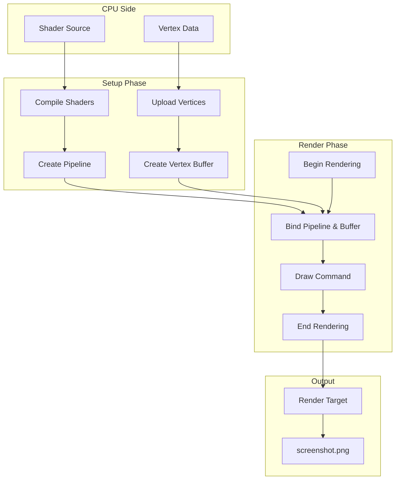
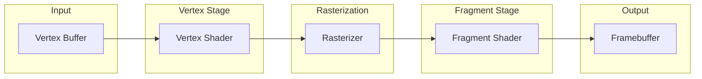
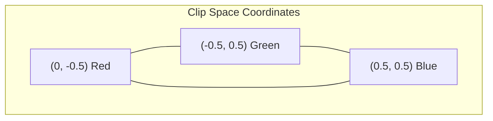
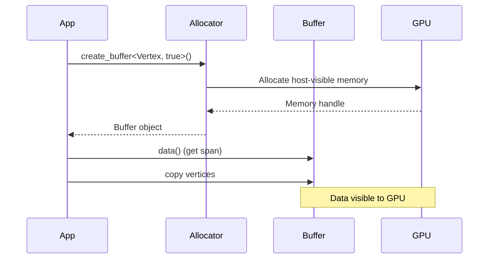

# Hello Triangle

Your first VulkanWrapper application - rendering a colored triangle.

## Overview

This tutorial teaches you to:
- Set up a graphics pipeline
- Create and upload vertex data
- Record draw commands
- Render to an image

## Architecture



## Concepts

### The Graphics Pipeline

The graphics pipeline defines how vertices are transformed into pixels:



### Vertex Structure

Each vertex has:
- **Position** (vec3): Where the vertex is in clip space
- **Color** (vec3): The vertex color (interpolated across the triangle)

```cpp
struct TriangleVertex {
    glm::vec3 position;
    glm::vec3 color;
};
```

## Implementation

### Step 1: Define Vertices

Create three vertices forming a triangle:

```cpp
constexpr std::array<TriangleVertex, 3> triangleVertices = {{
    {{0.0f, -0.5f, 0.0f}, {1.0f, 0.0f, 0.0f}},   // Top (red)
    {{-0.5f, 0.5f, 0.0f}, {0.0f, 1.0f, 0.0f}},   // Bottom-left (green)
    {{0.5f, 0.5f, 0.0f}, {0.0f, 0.0f, 1.0f}}     // Bottom-right (blue)
}};
```



### Step 2: Write Shaders

**Vertex Shader** - Transforms vertices and passes color to fragment shader:

```glsl
#version 450

layout(location = 0) in vec3 inPosition;
layout(location = 1) in vec3 inColor;

layout(location = 0) out vec3 fragColor;

void main() {
    gl_Position = vec4(inPosition, 1.0);
    fragColor = inColor;
}
```

**Fragment Shader** - Outputs the interpolated color:

```glsl
#version 450

layout(location = 0) in vec3 fragColor;
layout(location = 0) out vec4 outColor;

void main() {
    outColor = vec4(fragColor, 1.0);
}
```

### Step 3: Create Pipeline

Build the graphics pipeline with the builder pattern:

```cpp
m_pipeline = GraphicsPipelineBuilder(device())
    .set_layout(m_pipelineLayout)
    .add_shader(vk::ShaderStageFlagBits::eVertex, m_vertexShader)
    .add_shader(vk::ShaderStageFlagBits::eFragment, m_fragmentShader)
    .set_vertex_input<TriangleVertex>()
    .set_topology(vk::PrimitiveTopology::eTriangleList)
    .set_polygon_mode(vk::PolygonMode::eFill)
    .set_cull_mode(vk::CullModeFlagBits::eNone)
    .add_dynamic_state(vk::DynamicState::eViewport)
    .add_dynamic_state(vk::DynamicState::eScissor)
    .add_color_attachment(config().colorFormat)
    .build();
```

### Step 4: Create Vertex Buffer

Create a host-visible vertex buffer and upload data:

```cpp
// Create buffer
m_vertexBuffer = allocator()->create_buffer<TriangleVertex, true,
                                            VertexBufferUsage>(
    triangleVertices.size());

// Upload data
auto span = m_vertexBuffer->data();
std::ranges::copy(triangleVertices, span.begin());
```



### Step 5: Record Draw Commands

Record commands to render the triangle:

```cpp
void render(vk::CommandBuffer cmd, uint32_t frameIndex) {
    // Begin dynamic rendering
    beginRendering(cmd, vk::AttachmentLoadOp::eClear,
                   {{{0.1f, 0.1f, 0.15f, 1.0f}}});

    // Bind pipeline
    cmd.bindPipeline(vk::PipelineBindPoint::eGraphics,
                     m_pipeline->handle());

    // Bind vertex buffer
    cmd.bindVertexBuffers(0, m_vertexBuffer->handle(), vk::DeviceSize{0});

    // Draw 3 vertices as 1 instance
    cmd.draw(3, 1, 0, 0);

    // End rendering
    endRendering(cmd);
}
```

## Result


The output shows a triangle with:
- Red vertex at the top
- Green vertex at bottom-left
- Blue vertex at bottom-right
- Colors smoothly interpolated across the surface

## Full Source Code

The complete source code is available at:
`docs/tutorials/01-triangle/main.cpp`

## Key Takeaways

1. **Vertex Structure**: Define your vertex format with position and attributes
2. **Pipeline Builder**: Use the fluent API to configure the graphics pipeline
3. **Host-Visible Buffers**: Use `Buffer<T, true, Usage>` for CPU-accessible data
4. **Dynamic Rendering**: No render pass objects needed with Vulkan 1.3

## Next Steps

- [Hello Texture](./hello-texture) - Add texture mapping to your triangle
- [Buffers](./buffers) - Learn about different buffer types
