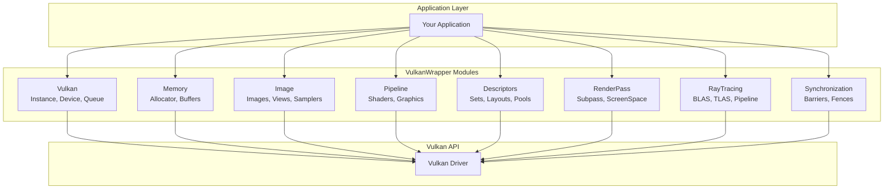
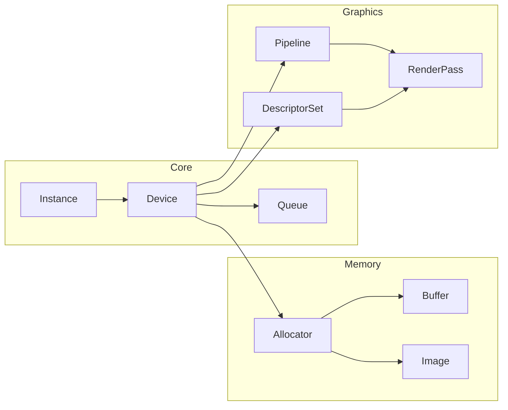
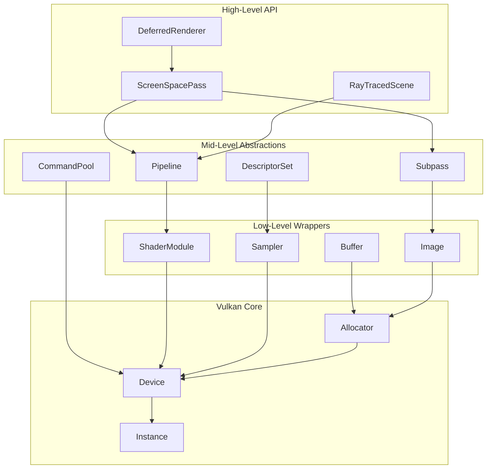
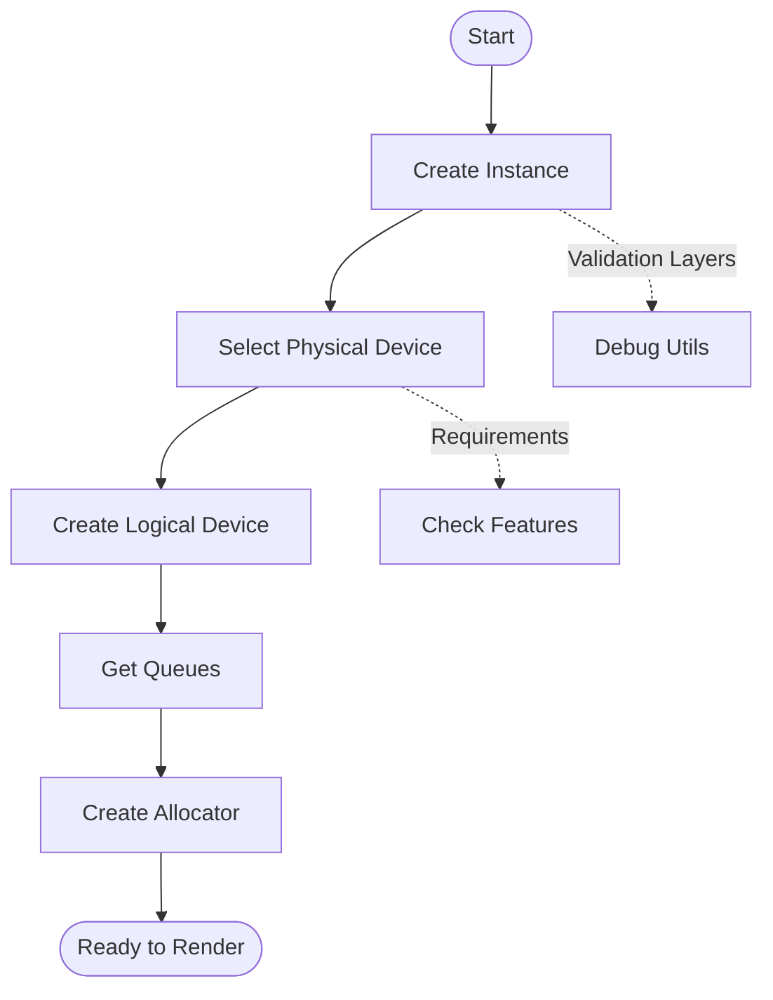

# Architecture Diagram Templates

## Template 1: Module Overview

Use for showing relationships between library modules.

## Template 2: Component Dependencies

Use for showing how modules depend on each other.

## Template 3: Layered Architecture

Use for showing abstraction layers.

## Template 4: Initialization Flow

Use for showing startup sequence.

## Customization Guide

1. **Replace placeholders** with actual component names
2. **Add/remove nodes** as needed for your documentation
3. **Use subgraphs** to group related components
4. **Add edge labels** for relationship descriptions
5. **Use shapes** to distinguish component types:
   - `[Rectangle]` for classes/modules
   - `([Stadium])` for entry/exit points
   - `{Diamond}` for decisions
   - `[(Database)]` for storage
