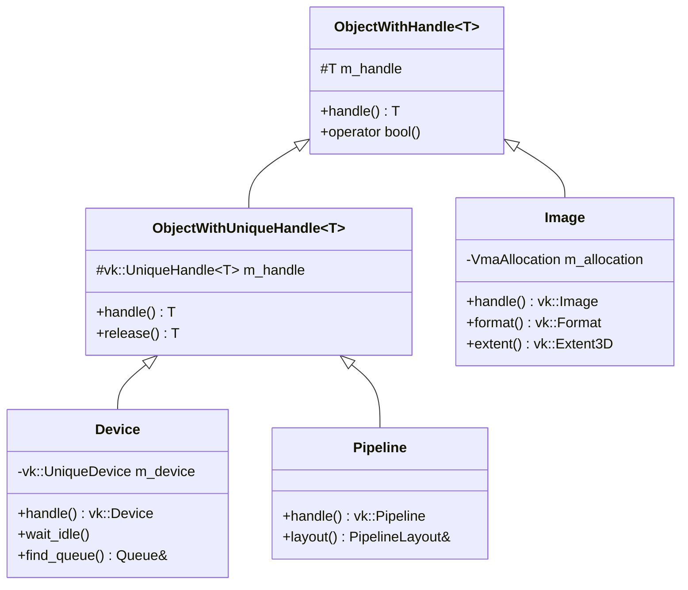
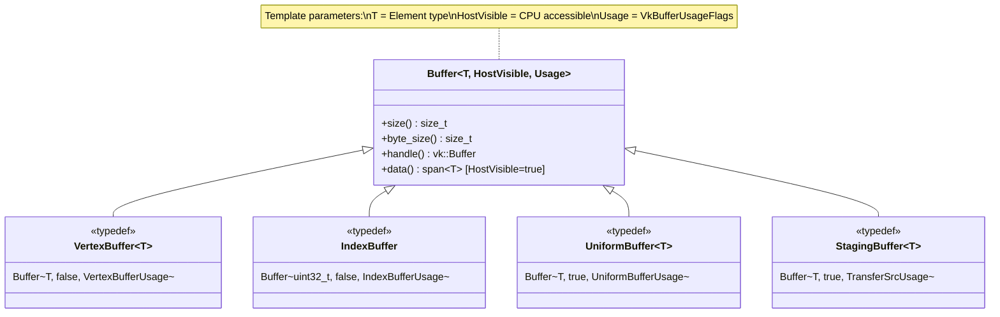
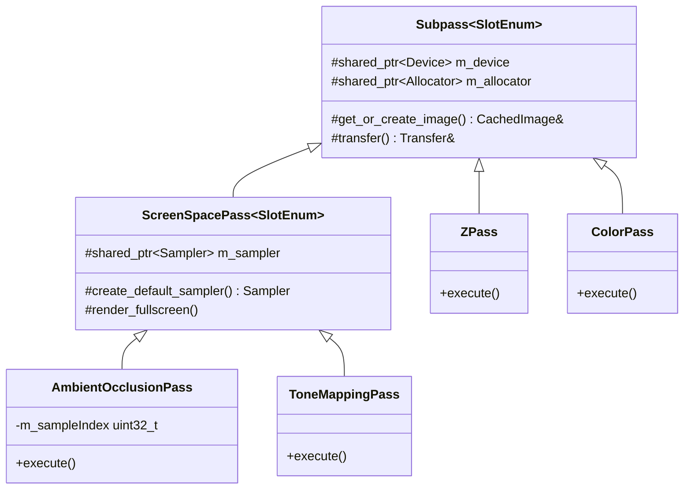
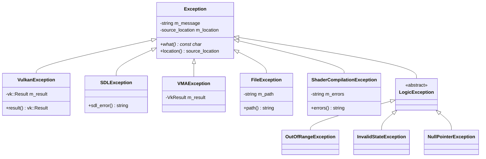
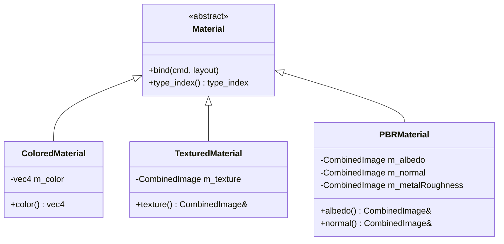
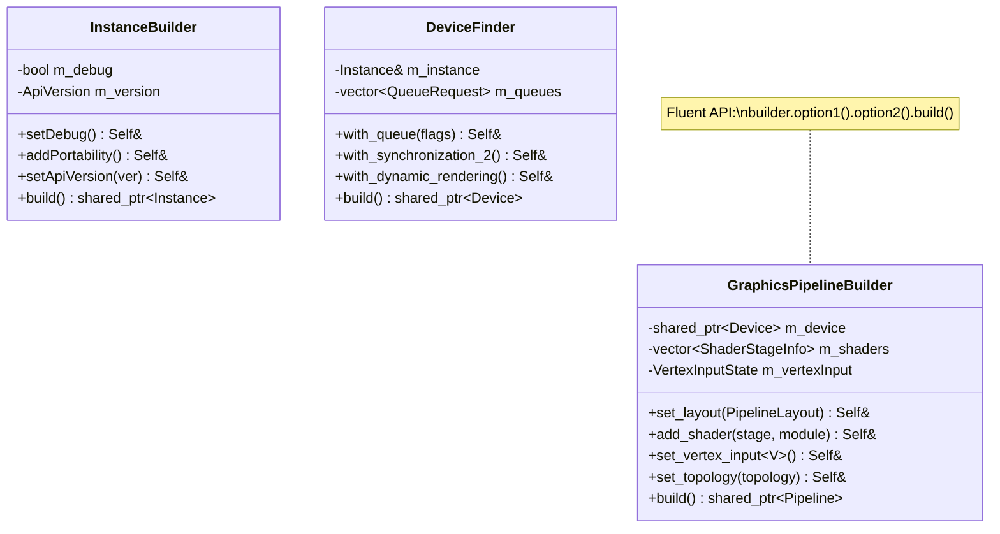

# Class Hierarchy Diagram Templates

## Template 1: Handle Wrapper Hierarchy

Use for documenting the Vulkan handle wrapper pattern.

## Template 2: Buffer Type Hierarchy

Use for documenting type-safe buffers.

## Template 3: Render Pass Hierarchy

Use for documenting the render pass abstraction.

## Template 4: Exception Hierarchy

Use for documenting error handling.

## Template 5: Material System Hierarchy

Use for documenting polymorphic systems.

## Template 6: Builder Pattern Classes

Use for documenting builder APIs.

## Customization Guide

1. **Use `~T~` notation** for template parameters
2. **Mark abstract classes** with `<<abstract>>`
3. **Mark typedefs** with `<<typedef>>`
4. **Show key methods** only, not all
5. **Add notes** for important implementation details
6. **Use inheritance arrows** pointing from derived to base
