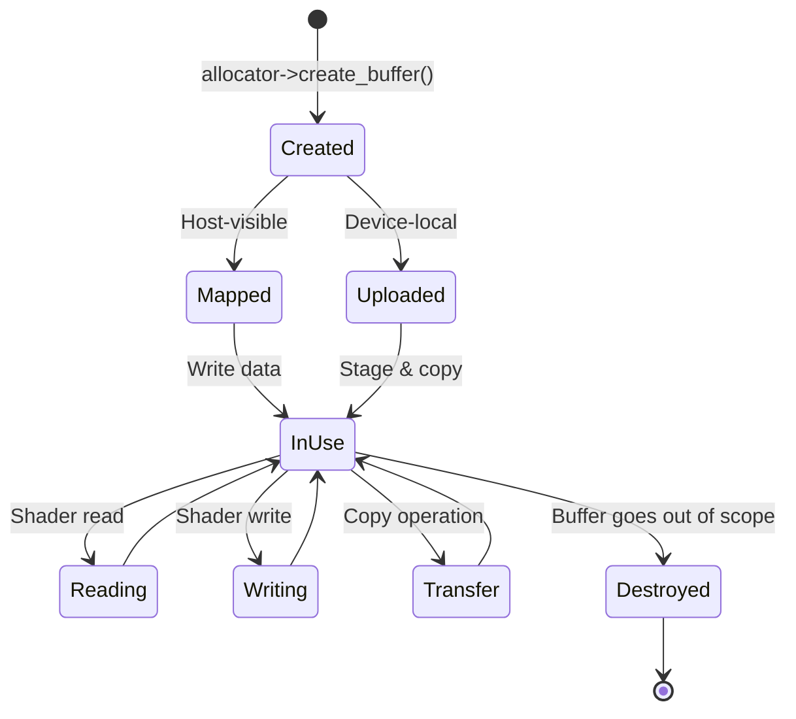
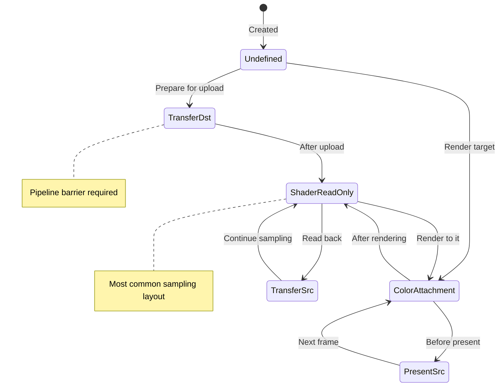
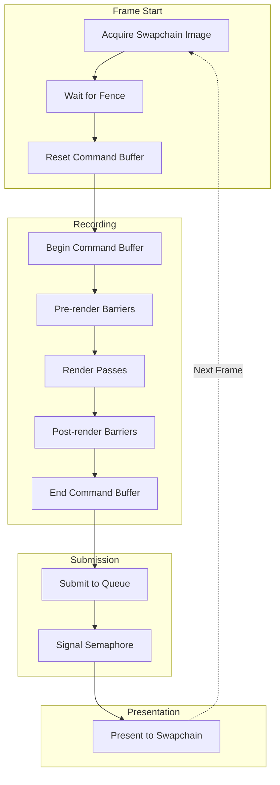
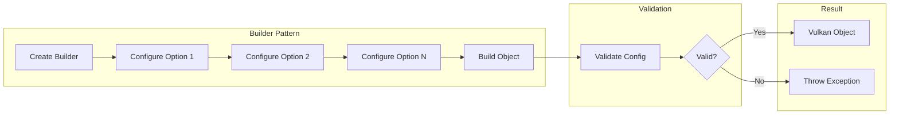
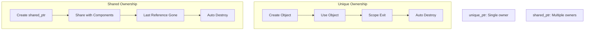
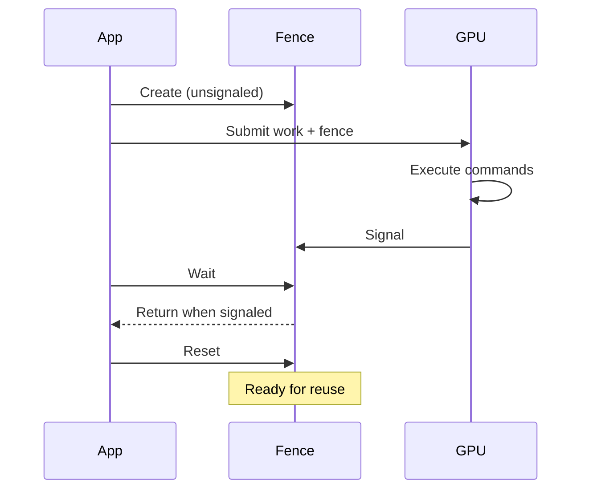

# Resource Lifecycle Diagram Templates

## Template 1: Buffer Lifecycle

Use for documenting buffer creation and usage.

## Template 2: Image State Transitions

Use for documenting image layout transitions.

## Template 3: Frame Lifecycle

Use for documenting per-frame operations.

## Template 4: Object Creation Pattern

Use for documenting builder patterns.

## Template 5: RAII Ownership

Use for documenting resource ownership.

## Template 6: Synchronization Lifecycle

Use for documenting sync primitive usage.

## Customization Guide

1. **Use state diagrams** for object states
2. **Use flowcharts** for creation sequences
3. **Use sequence diagrams** for temporal interactions
4. **Add notes** for important details
5. **Show error paths** with dashed lines
