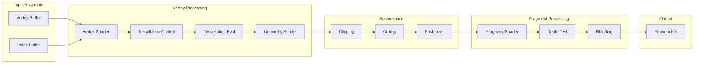
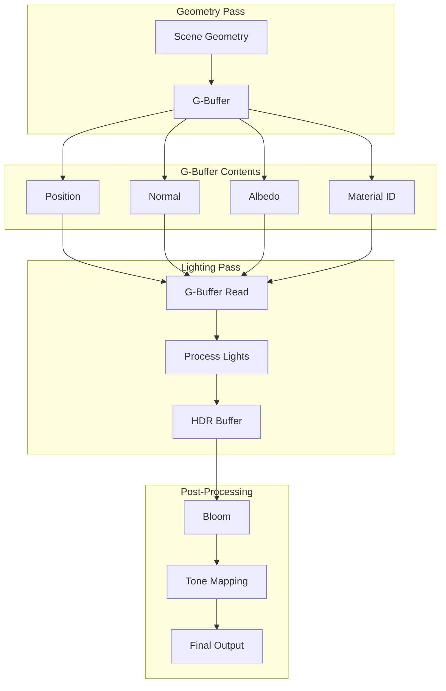
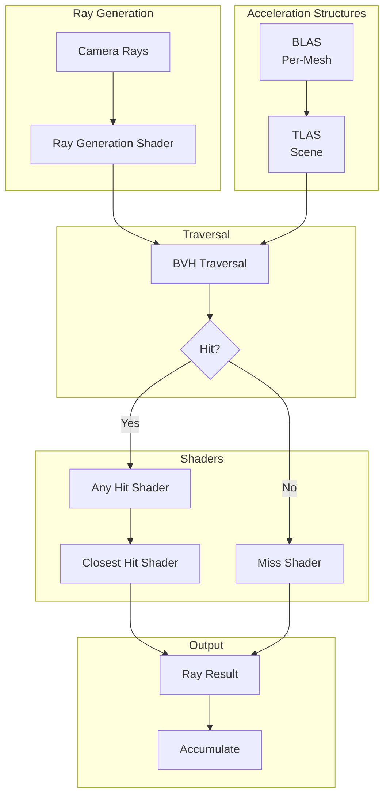
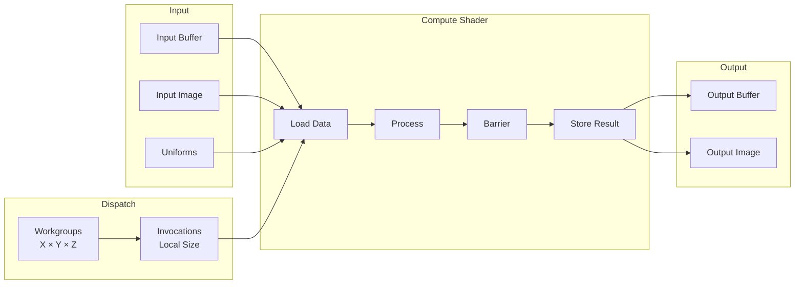
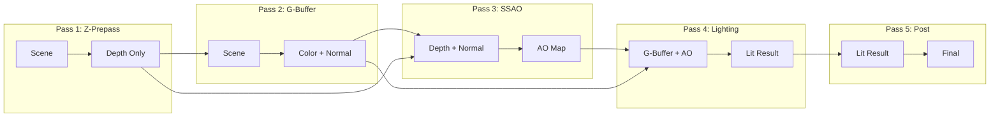

# Pipeline Flow Diagram Templates

## Template 1: Graphics Pipeline Stages

Use for showing GPU pipeline stages.

## Template 2: Deferred Rendering Pipeline

Use for multi-pass rendering documentation.

## Template 3: Ray Tracing Pipeline

Use for RT shader documentation.

## Template 4: Compute Pipeline

Use for compute shader documentation.

## Template 5: Data Flow Through Passes

Use for multi-pass rendering.

## Customization Guide

1. **Use subgraphs** to group pipeline stages
2. **Show data flow** with arrows
3. **Add conditional branches** for hit/miss scenarios
4. **Include buffers/images** as inputs/outputs
5. **Use colors** via CSS classes for emphasis
