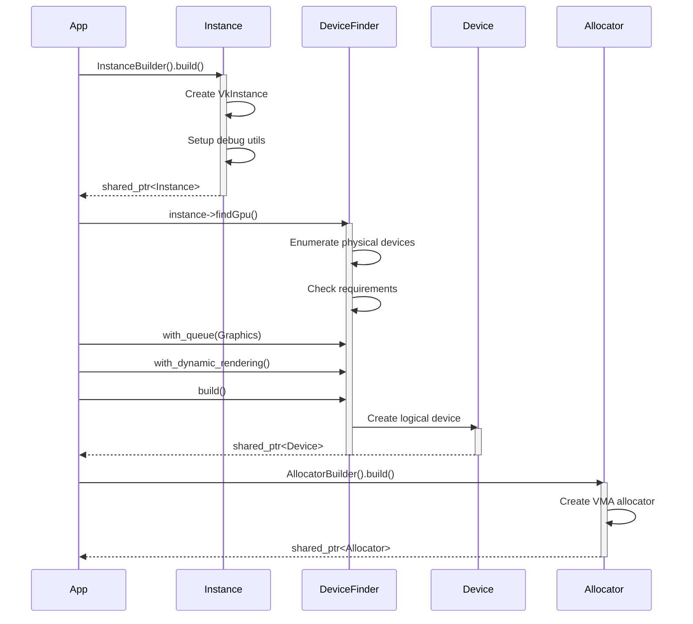
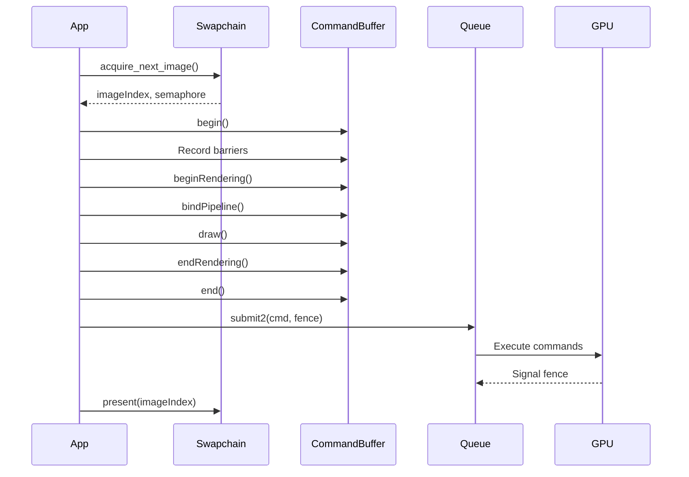
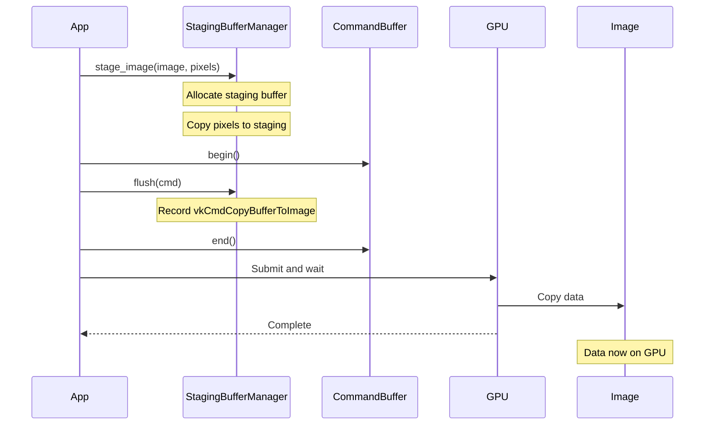
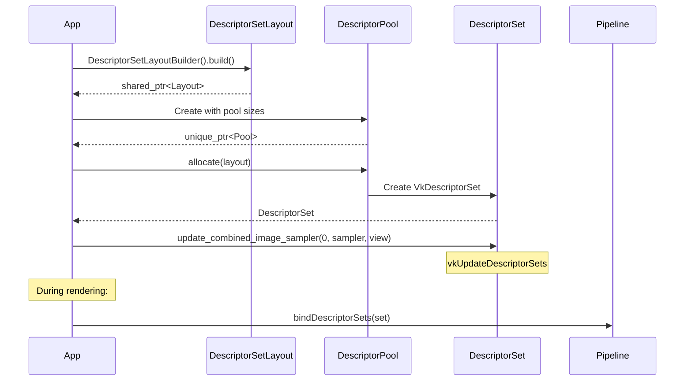
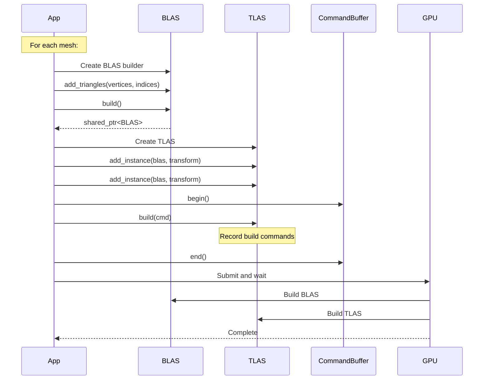
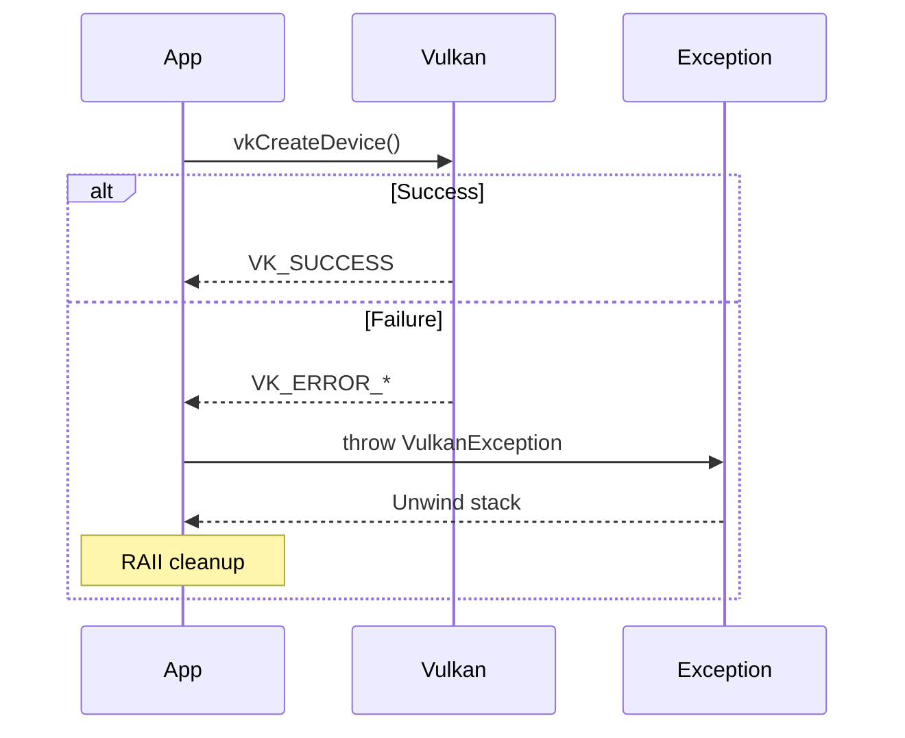
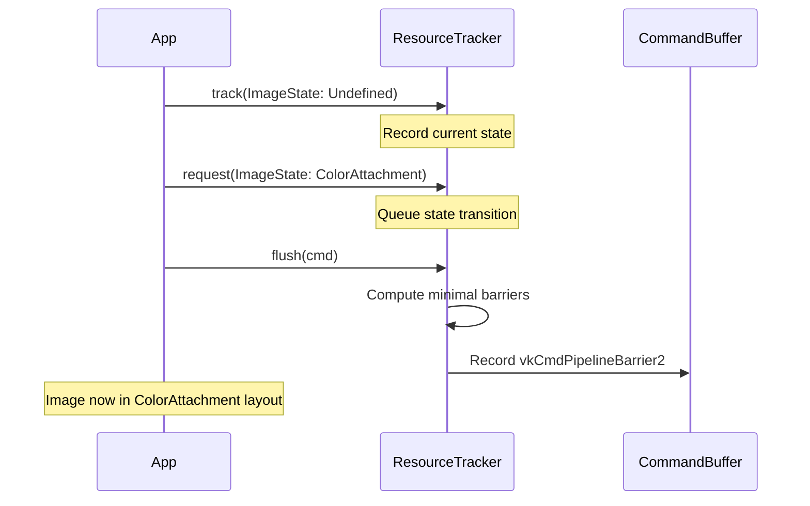

# Sequence Diagram Templates

## Template 1: Initialization Sequence

Use for documenting startup flows.

## Template 2: Render Frame Sequence

Use for documenting frame rendering.

## Template 3: Resource Upload Sequence

Use for documenting staging buffer uploads.

## Template 4: Descriptor Update Sequence

Use for documenting descriptor binding.

## Template 5: Ray Tracing Build Sequence

Use for documenting acceleration structure building.

## Template 6: Error Handling Sequence

Use for documenting error flows.

## Template 7: Resource Tracking Sequence

Use for documenting automatic barrier generation.

## Customization Guide

1. **Use participants** for components
2. **Use activate/deactivate** for lifetimes
3. **Use notes** for important details
4. **Use alt/else** for conditional paths
5. **Use loops** for repeated operations
6. **Keep messages concise** - one action per arrow
